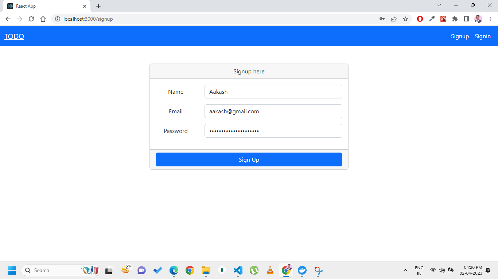
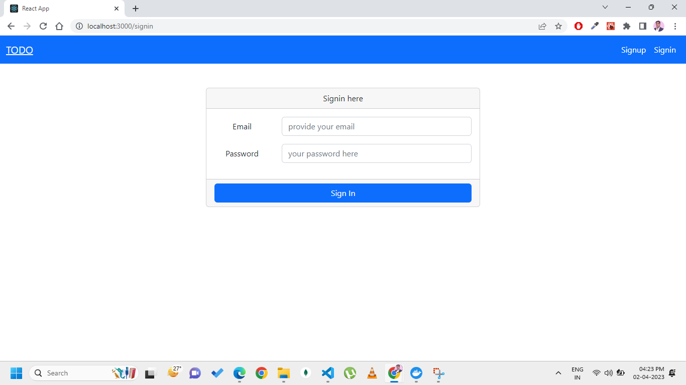
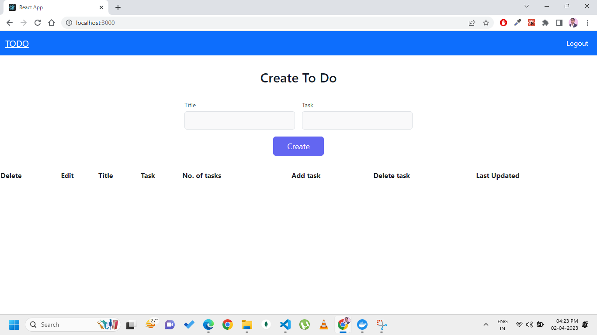

# Task Management App

A task management application built using MERN stack and Appwrite for authentication. This application allows you to create, edit, and delete tasks and todos, and also tracks the timestamp of when each action was performed.

## Technologies Used

- MongoDB
- Express.js
- React.js
- Node.js
- Appwrite

## Features

- User authentication using Appwrite
- Create, edit, and delete Title
- Create, edit, and delete Tasks
- Timestamps for each task and todo action

## Getting Started

### Prerequisites

- Node.js
- MongoDB
- Appwrite account and API keys

### Installation

1. Clone the repository
git clone https://github.com/aakashkilhor/todo-mern-with-appwrite-authentication.git

2. Navigate to the project directory
cd todo-mern-with-appwrite-authentication

3. Install the dependencies
npm install

4. Create a `.env` file and add the following variables as per the sample env file:

MONGODB_URI=<your_mongodb_uri>

APPWRITE_ENDPOINT=<your_appwrite_endpoint>

APPWRITE_PROJECT_ID=<your_appwrite_project_id>

APPWRITE_API_KEY=<your_appwrite_api_key>

5. Run the application

npm start

6. Open http://localhost:3000 in your browser

That's it! Now you should have a fully functional task management application. If you have any questions or issues, please feel free to reach out.

### Sample Images

